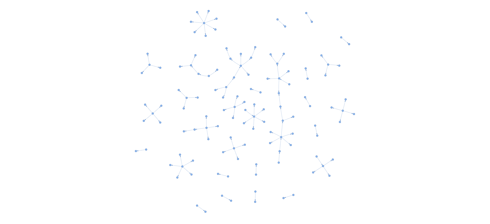
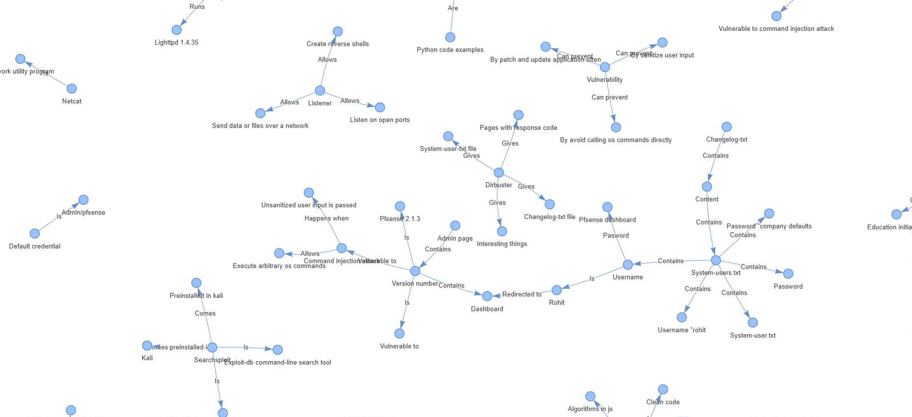
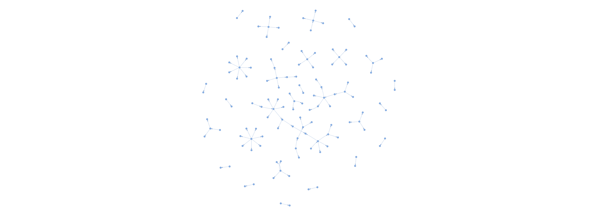
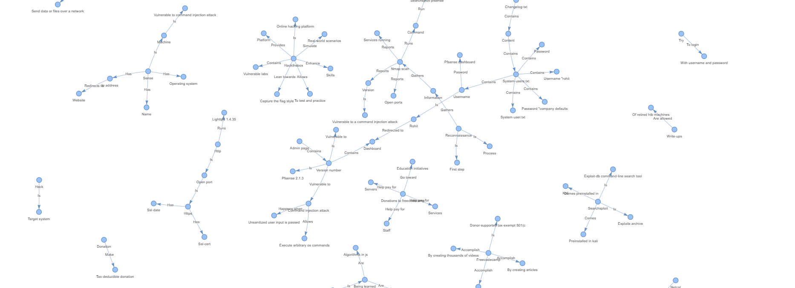

# Knowledge Graph Builder and Query Application

This application constructs, updates, and queries a knowledge graph using content fetched from provided URLs. The graph is visualized as a network and stored for subsequent queries, enabling efficient knowledge extraction for future requests.

## Project Structure

```
.
├── app.py                      # Main application file
├── templates/
│   └── index.html              # Frontend form for URL input and querying
├── README.md                   # Project documentation
├── graph_builder.py            # Module to initialize and build the knowledge graph
├── graph_updater.py            # Module to update the knowledge graph with new data
├── information_retriever.py     # Module to query information from the knowledge graph
├── content_fetcher.py          # Module to fetch content from URLs
└── setEnvironment_variable.py   # Script to set environment variables
```

## Setup and Installation

1. **Clone the Repository**:
   ```bash
   git clone <repository-url>
   cd <repository-name>
   ```

2. **Install Dependencies**:
   Ensure you have Python 3.7+ and the required libraries installed:
   ```bash
   pip install -r requirements.txt
   ```

3. **Environment Variables**:
   Set the necessary environment variables in `setEnvironment_variable.py` for the storage directory.

4. **Run the Application**:
   Start the Flask server by running:
   ```bash
   python app.py
   ```

## Application Workflow

1. **Content Fetching**:
   - A `ContentFetcher` instance takes the provided URL and scrapes the page content using `requests` and `BeautifulSoup`.
   - Extracted content is stored as plain text for graph processing.

2. **Knowledge Graph Building**:
   - The `GraphBuilder` module utilizes **HuggingFace embeddings** and **OpenAI’s LLM** to convert text content into knowledge triplets (e.g., `(subject, predicate, object)`).
   - These triplets form the nodes and edges of the knowledge graph, which are stored in `SimpleGraphStore`.
   - A directed graph is visualized with PyVis for a comprehensive view.

3. **Graph Updating**:
   - The `GraphUpdater` module allows new URLs to be added to the existing knowledge graph. New triplets are extracted and stored, maintaining graph consistency.

4. **Querying the Knowledge Graph**:
   - Users can input queries through the frontend, processed by the `InformationRetriever`.
   - The knowledge graph is queried using similarity search, leveraging both keyword and hybrid embeddings, and returns relevant information in response to the user’s query.

## Modules and Components

- **`GraphBuilder`**:
  - Builds and visualizes the knowledge graph from the extracted triplets.
  - Utilizes OpenAI’s LLM and HuggingFace embedding model to enhance entity recognition and relation extraction.
  - Persists the graph data for efficient loading and querying in future sessions.

- **`GraphUpdater`**:
  - Accepts new content, processes it into triplets, and integrates it into the existing knowledge graph structure.

- **`InformationRetriever`**:
  - Queries the knowledge graph with user-provided queries, utilizing `as_query_engine` with `tree_summarize` and `hybrid` embedding modes for accurate results.
  - Offers top-k similarity-based retrieval for better result accuracy.

### Application Routes

- **`/create_graph`** (`POST`): Creates a new knowledge graph from the URL-provided content.
- **`/update_graph`** (`POST`): Updates the existing knowledge graph with new data from a specified URL.
- **`/query_graph`** (`POST`): Queries the graph using the specified user query and returns relevant results.

## Example Diagram

> **Note**: Add diagrams to illustrate the workflow, such as the graph-building process, query processing flow, and visualization architecture. Place diagrams in the `/diagrams` directory.

## Graph Visualization

> **Graph With First Url Embedded** :https://www.freecodecamp.org/news/sense-walkthrough-hackthebox/





**Graph With First Url and Second Url Embedded** : https://www.freecodecamp.org/news/sense-walkthrough-hackthebox/ && https://medium.com/@heyrm/usage-machine-hackthebox-writeup-journey-through-exploitation-16397895490f






## Future Enhancements

- Support additional content types (PDF, images) for graph-building.
- Implement distributed storage and querying for large-scale graphs.
- Add UI improvements for dynamic query visualization.

## Contributions

Contributions are welcome! If you have suggestions, feel free to open a pull request or report an issue.

---